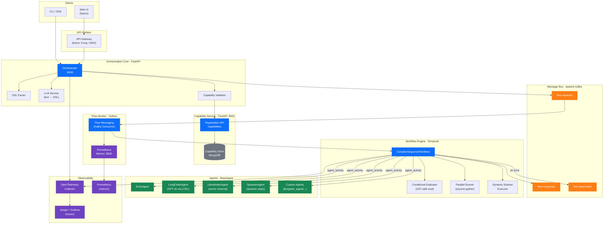
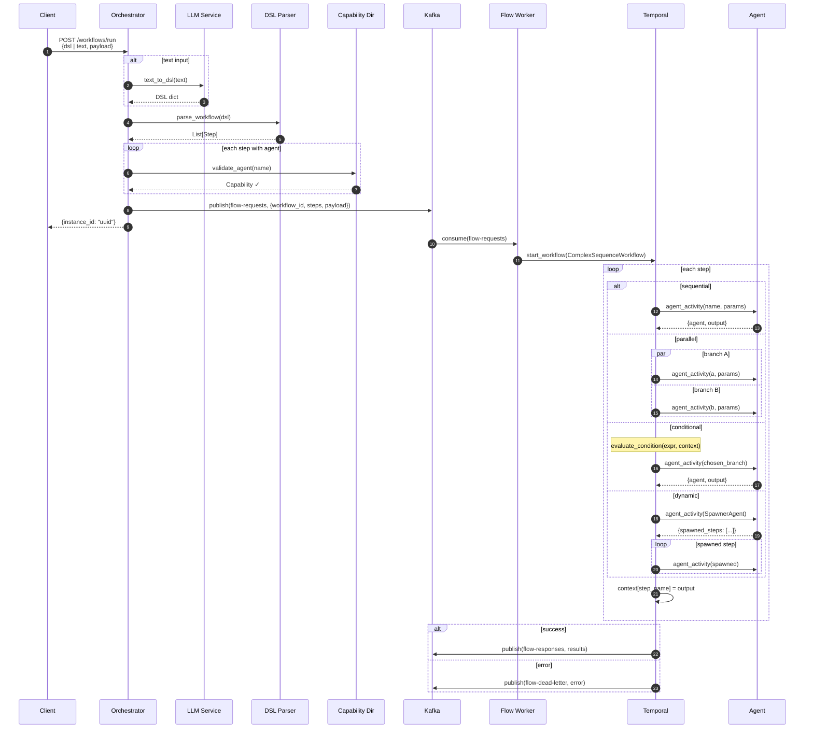
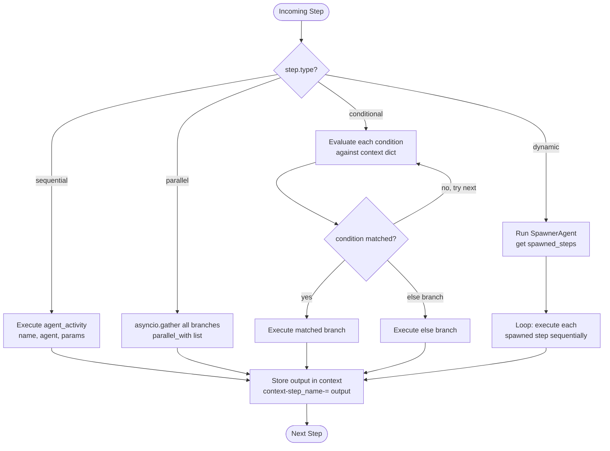
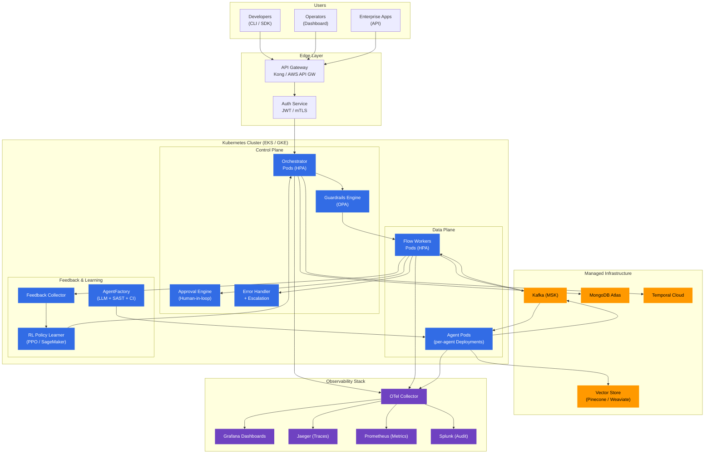
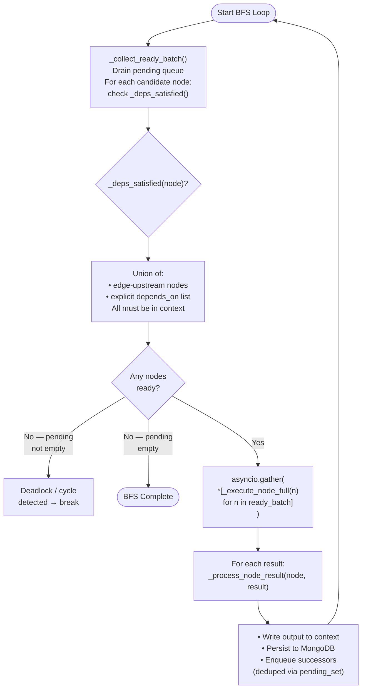
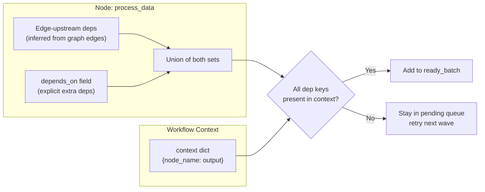
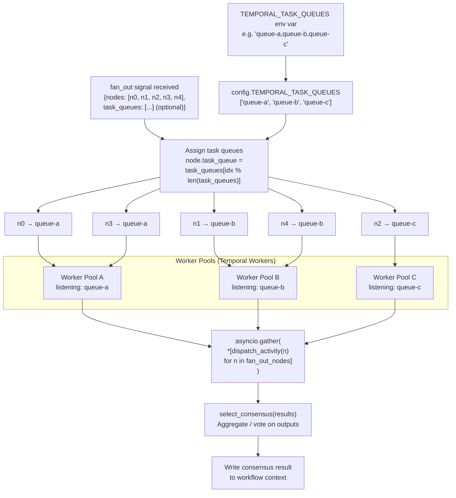
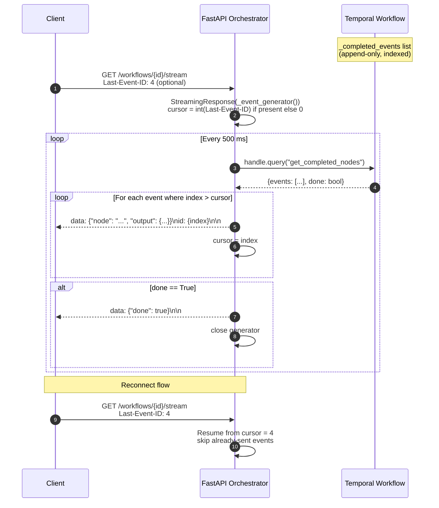
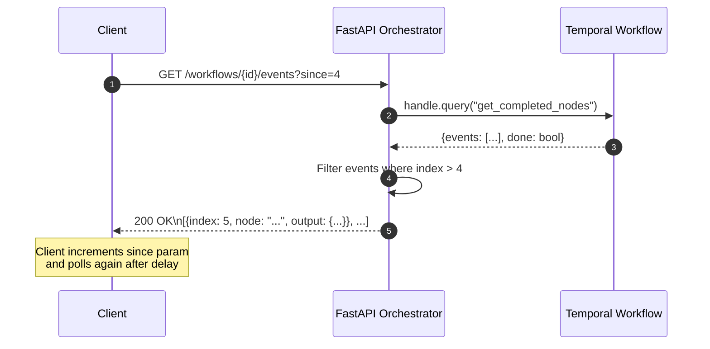
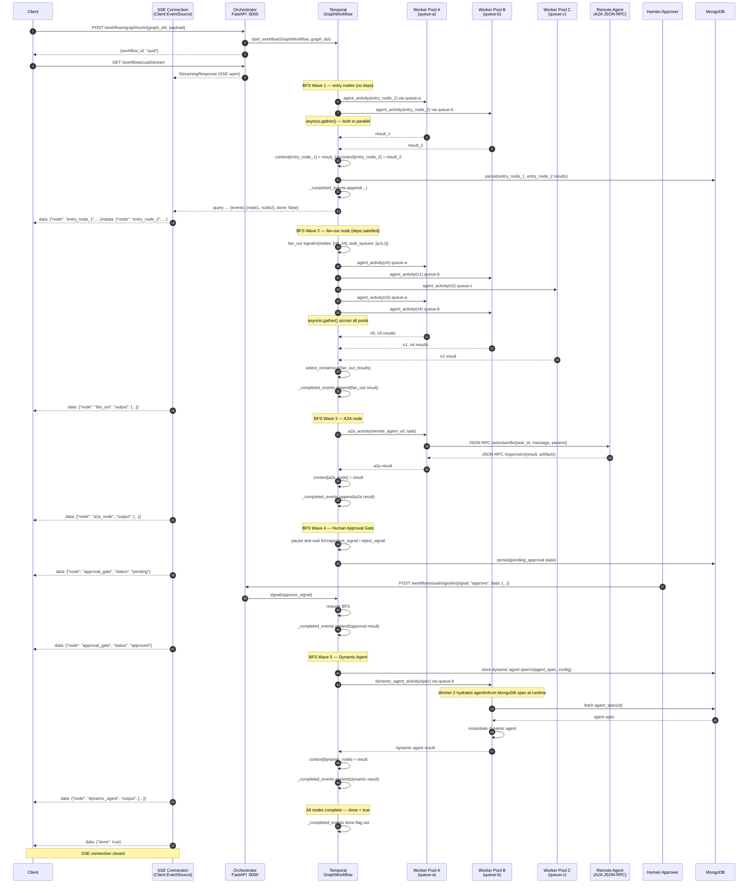

# Multigen Architecture

## 1. System Architecture

High-level view of all services, their roles, and communication paths.



---

## 2. Request Flow

End-to-end trace of a workflow from client submission to agent execution.



---

## 3. Step Execution Model

How the workflow engine handles the four DSL step types.



---

## 4. Agent Registration & Discovery

How agents register themselves and how the orchestrator resolves them.

```mermaid
flowchart LR
    subgraph Agent Process
        A["@register_agent('Name')<br/>class MyAgent(BaseAgent)"]
        REG_CALL["self_register()<br/>on startup"]
    end

    subgraph Registry
        MEM["In-Memory Registry<br/>_registry: Dict[str, Type]"]
        CAP_SVC["Capability Directory<br/>(MongoDB)"]
    end

    subgraph Orchestrator
        LOOKUP["get_agent(name)<br/>from agent_registry"]
        VALIDATE["validate_agent(name)<br/>HTTP → capability-service"]
    end

    A -->|@register_agent decorator| MEM
    REG_CALL -->|POST /capabilities| CAP_SVC

    VALIDATE -->|GET /capabilities/name| CAP_SVC
    CAP_SVC -->|Capability metadata| VALIDATE

    LOOKUP -->|instantiate + run| A
```

---

## 5. DSL Reference

Valid step structures in the Multigen workflow DSL.

```mermaid
block-beta
  columns 1
  block:seq["Sequential Step"]:1
    S1["name: step_name\nagent: EchoAgent\nparams:\n  key: value"]
  end
  block:par["Parallel Step"]:1
    S2["name: parallel_step\nparallel:\n  - name: branch_a\n    agent: AgentA\n  - name: branch_b\n    agent: AgentB"]
  end
  block:cond["Conditional Step"]:1
    S3["name: route\nconditional:\n  - condition: \"status == 'approved'\"\n    then: ApprovalAgent\nelse: RejectionAgent"]
  end
  block:dyn["Dynamic Subtree Step"]:1
    S4["name: expand\nagent: SpawnerAgent\nparams:\n  count: 3\n  agent: EchoAgent\ndynamic_subtree:\n  config: {}"]
  end
```

---

## 6. Enterprise Target Architecture

The planned production-scale deployment.



---

## 7. Parallel BFS Execution Model

How the graph workflow executes dependency-aware waves of nodes in parallel using a BFS loop.



Dependency resolution detail — `depends_on` union with edge-derived deps:



---

## 8. Partition-Aware Fan-Out

How fan-out nodes are distributed across multiple Temporal task queues for parallel execution on separate worker pools.



---

## 9. SSE Streaming Architecture

How completed node events are streamed to clients in real time via Server-Sent Events, with polling fallback.



Polling fallback for clients that do not support SSE:



---

## 10. Updated Request Flow (Graph Workflow with All Features)

End-to-end sequence covering parallel BFS execution, partition-aware fan-out, SSE streaming, A2A nodes, human approval gates, and dynamic agents.


